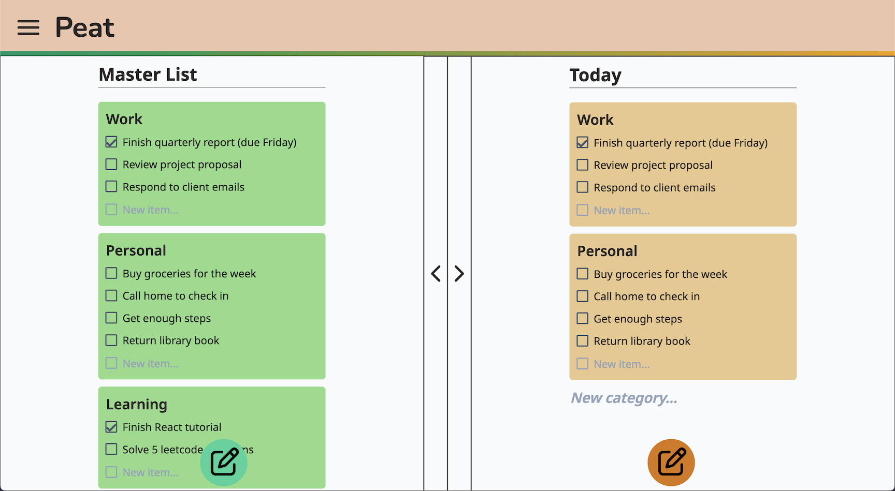
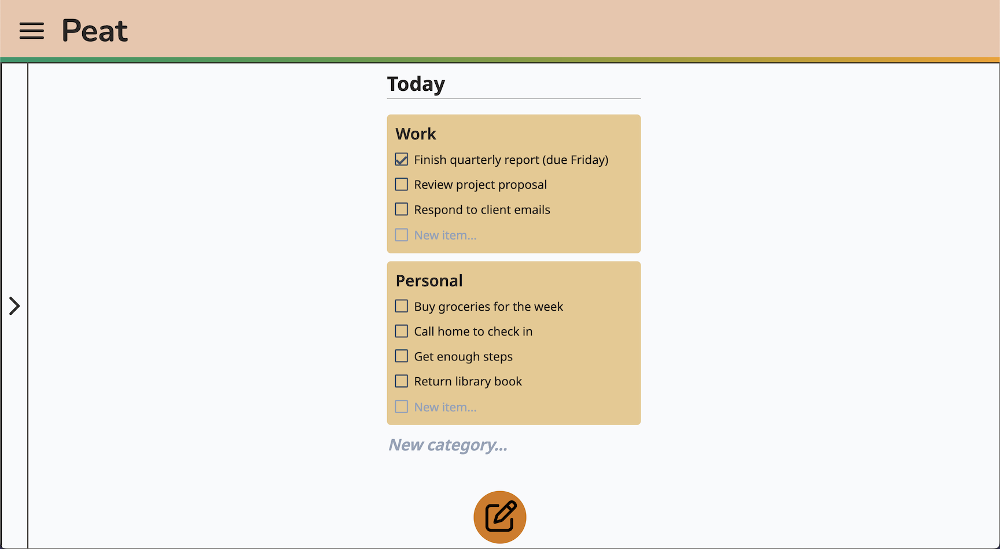
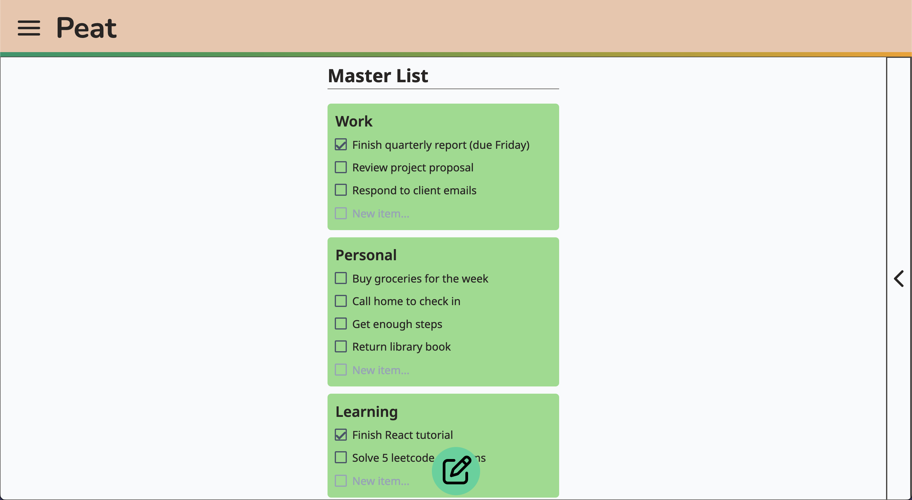

# Peat

## Description
Peat is a web app for managing checklists of tasks, made in Next.js and React.
Users can:
- Create and edit tasks in-line.
- Organize tasks into projects for categorization.
- Create a master list.
- Focus on daily priorities by sending selected projects to a dedicated daily list.

## Screenshots




## Getting Started
First, run the development server:

```bash
npm run dev
# or
yarn dev
# or
pnpm dev
# or
bun dev
```

Open [http://localhost:3000](http://localhost:3000) with your browser to see the result.
